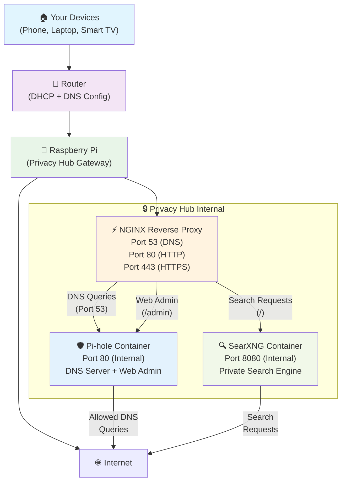
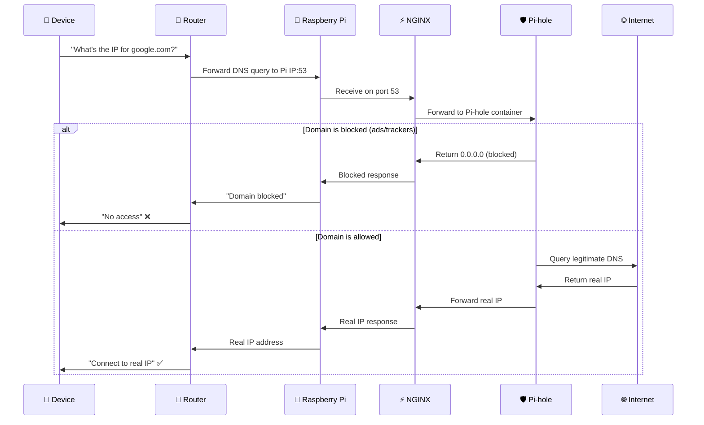
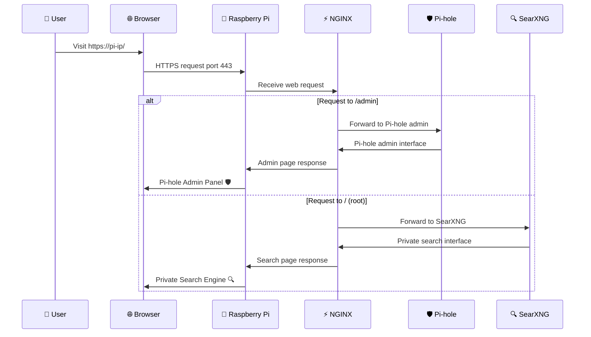
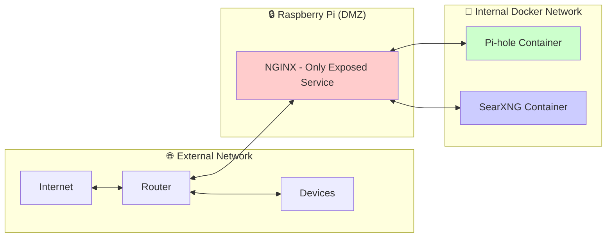
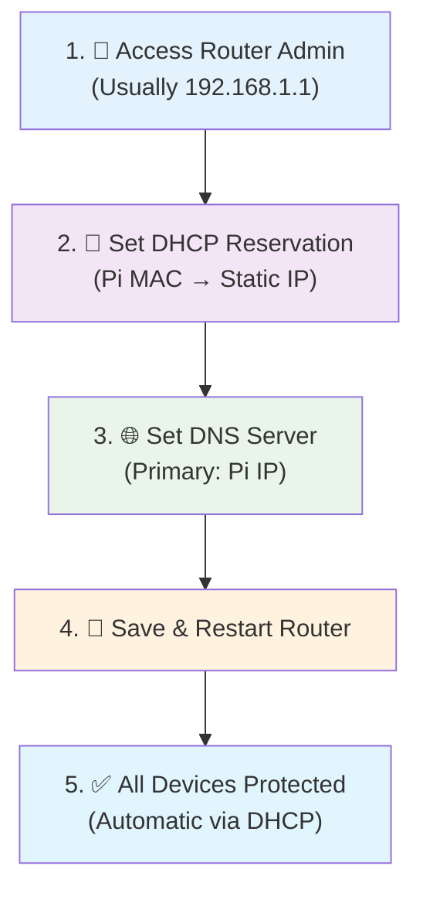

# 🏗️ Network Architecture Deep Dive

## 🎯 **Privacy Hub Network Flow**

Privacy Hub transforms your Raspberry Pi into a comprehensive privacy gateway. Here's exactly how traffic flows through the system:

### 📊 **Complete Network Diagram**



## 🔄 **Traffic Flow Breakdown**

### 1. 🌐 **DNS Resolution Flow** (Ad Blocking)



### 2. 🔍 **Web Traffic Flow** (Private Search & Admin)



## 🔧 **Port Mapping & Security**

### **External Ports (Raspberry Pi)**
| Port | Service | Purpose | Access |
|------|---------|---------|---------|
| `53` | DNS | Pi-hole DNS resolution | All devices via router |
| `80` | HTTP | Redirects to HTTPS | Web browsers |
| `443` | HTTPS | Secure web access | Web browsers |

### **Internal Docker Network**
| Container | Internal Port | Purpose | External Access |
|-----------|---------------|---------|-----------------|
| **Pi-hole** | `80` | DNS + Web Admin | Via NGINX `/admin` |
| **SearXNG** | `8080` | Private Search | Via NGINX `/` |
| **NGINX** | `53,80,443` | Reverse Proxy | Direct from Pi |

### 🛡️ **Security Architecture**



**Security Benefits:**
- ✅ **Single Entry Point**: Only NGINX exposed to network
- ✅ **Container Isolation**: Pi-hole & SearXNG not directly accessible
- ✅ **HTTPS Everywhere**: All web traffic encrypted
- ✅ **Minimal Attack Surface**: Professional reverse proxy architecture

## 📝 **Router Configuration Explained**

### **Why Set Router DNS to Pi IP?**

When you configure your router's DNS to point to your Raspberry Pi's IP address:

1. **All devices automatically inherit this setting** via DHCP
2. **Every DNS query** goes through Pi-hole for filtering
3. **No per-device configuration** needed
4. **Instant network-wide protection** for all connected devices

### **Configuration Steps:**



## 🔗 **Quick Access Links**

### **Pi-hole Management**
- 📊 **Dashboard**: `https://your-pi-ip/admin`
- 🚫 **Blocklist Management**: `https://your-pi-ip/admin/groups-adlists.php`
- 📈 **Query Log**: `https://your-pi-ip/admin/queries.php`
- ⚙️ **Settings**: `https://your-pi-ip/admin/settings.php`
- 🔄 **Disable/Enable**: `https://your-pi-ip/admin/api.php`

### **SearXNG Customization**
- 🔍 **Search Interface**: `https://your-pi-ip/`
- ⚙️ **Preferences**: `https://your-pi-ip/preferences`
- 🎨 **Themes**: `https://your-pi-ip/preferences#ui`
- 🔒 **Safe Search**: `https://your-pi-ip/preferences#general`

## 📚 **External Documentation**

### **Pi-hole Resources**
- [Official Pi-hole Documentation](https://docs.pi-hole.net/)
- [Blocklist Collections](https://firebog.net/)
- [Pi-hole API Documentation](https://discourse.pi-hole.net/t/pi-hole-api/1863)
- [Custom DNS Records](https://docs.pi-hole.net/guides/dns/unbound/)

### **SearXNG Resources**
- [SearXNG Documentation](https://docs.searxng.org/)
- [Search Engine Configuration](https://docs.searxng.org/admin/engines.html)
- [Custom Themes](https://docs.searxng.org/dev/makefile.html#themes)
- [Instance Settings](https://docs.searxng.org/admin/settings.html)

### **NGINX Resources**  
- [NGINX Reverse Proxy Guide](https://docs.nginx.com/nginx/admin-guide/web-server/reverse-proxy/)
- [SSL/TLS Configuration](https://ssl-config.mozilla.org/)
- [Security Headers](https://securityheaders.com/)

## 🎯 **Network Troubleshooting**

### **Common Issues & Solutions**

| Issue | Symptom | Solution |
|-------|---------|----------|
| 🔴 **DNS not working** | Sites won't load | Check router DNS setting |
| 🟡 **Some ads showing** | Ads slip through | Update Pi-hole blocklists |
| 🔴 **Can't access admin** | 404/503 errors | Check NGINX routing |
| 🟡 **Search not working** | SearXNG errors | Restart SearXNG container |
| 🔴 **SSL warnings** | Certificate errors | Upgrade to trusted certificates |

### **Diagnostic Commands**
```bash
# Quick status check
./manage status

# Full network diagnostics  
./manage diagnose

# Test specific services
./manage logs nginx
./manage logs pihole
./manage logs searxng
```

---

**💡 Pro Tip**: Use `./manage` interactive menu to explore all network management options without memorizing commands!