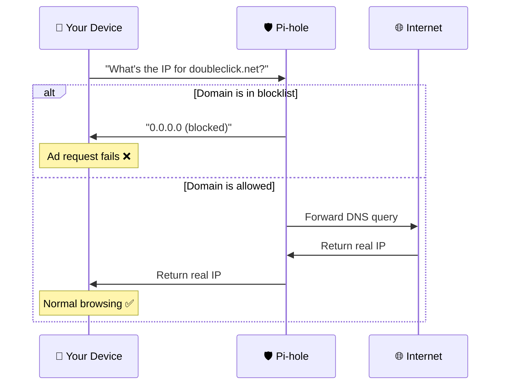

# 🛡️ Pi-hole Configuration & Customization Guide

## 🎯 **What is Pi-hole?**

Pi-hole is a **network-wide ad blocker** that acts as a DNS sinkhole. Instead of blocking ads on individual devices, it blocks them for your **entire network** by preventing DNS resolution for known advertising and tracking domains.

## 🌐 **How Pi-hole Works**



## 🔧 **Accessing Pi-hole Admin**

### **Web Interface**
- **URL**: `https://your-pi-ip/admin`
- **Password**: Auto-generated during setup (check with `./manage info`)

### **Command Line Access**
```bash
# Quick Pi-hole management
./manage

# Navigate to: Service Management → Pi-hole Management
# Or use direct commands:
./manage password    # Reset admin password
```

## 📊 **Pi-hole Dashboard Overview**

### **Main Dashboard Sections**

| Section | Purpose | Quick Link |
|---------|---------|------------|
| **📈 Queries Over Time** | DNS request patterns | `/admin` |
| **🎯 Query Types** | DNS record types (A, AAAA, etc.) | `/admin` |
| **🚫 Blocked Domains** | Top blocked advertising domains | `/admin` |
| **🔍 Query Log** | Real-time DNS request monitoring | `/admin/queries.php` |
| **📋 Blocklists** | Manage domain blocking sources | `/admin/groups-adlists.php` |

## 🚫 **Managing Blocklists**

### **Default Blocklists**

Privacy Hub comes pre-configured with effective blocklists. You can view them at:
**`https://your-pi-ip/admin/groups-adlists.php`**

### **Recommended Additional Blocklists**

```bash
# Access blocklist management
# Go to: Pi-hole Admin → Group Management → Adlists
```

**Recommended additions**:

| Blocklist | Purpose | URL |
|-----------|---------|-----|
| **🔒 StevenBlack Unified** | Comprehensive ad/malware blocking | `https://raw.githubusercontent.com/StevenBlack/hosts/master/hosts` |
| **📱 Mobile Ads** | Mobile app advertising | `https://raw.githubusercontent.com/AdguardTeam/AdguardFilters/master/MobileFilter/sections/adservers.txt` |
| **🎯 Tracking Protection** | Privacy tracking domains | `https://raw.githubusercontent.com/crazy-max/WindowsSpyBlocker/master/data/hosts/spy.txt` |
| **🛡️ Malware Domains** | Known malicious domains | `https://raw.githubusercontent.com/DandelionSprout/adfilt/master/Alternate%20versions%20Anti-Malware%20List/AntiMalwareHosts.txt` |

### **Adding Custom Blocklists**

1. **Navigate**: `https://your-pi-ip/admin/groups-adlists.php`
2. **Add New Adlist**:
   - **Address**: Paste blocklist URL
   - **Comment**: Descriptive name
   - **Groups**: Default (or custom group)
3. **Update Gravity**: Tools → Update Gravity

### **Creating Custom Block Rules**

```bash
# Block specific domains
./manage
# → Service Management → Pi-hole Management → Block/Unblock Domain

# Or manually via web interface:
# https://your-pi-ip/admin/groups-domains.php
```

## ✅ **Whitelist Management**

### **Common Domains to Whitelist**

Some legitimate services may be blocked by aggressive blocklists:

| Service | Domain to Whitelist | Why |
|---------|-------------------|-----|
| **🎵 Spotify** | `spclient.wg.spotify.com` | Music streaming |
| **📺 YouTube** | `s.youtube.com` | Video thumbnails |
| **🛒 Amazon** | `device-metrics-us.amazon.com` | Alexa functionality |
| **📱 Apple** | `mesu.apple.com` | iOS updates |
| **🎮 Steam** | `clientconfig.akamai.steamstatic.com` | Game downloads |

### **Whitelist via Web Interface**

1. **Navigate**: `https://your-pi-ip/admin/groups-domains.php`
2. **Add to Whitelist**:
   - **Domain**: Enter domain name
   - **Type**: Exact whitelist
   - **Groups**: Default
3. **Save and Update**

### **Whitelist via Command Line**

```bash
# Interactive domain management
./manage
# → Service Management → Pi-hole Management → Block/Unblock Domain
```

## 📝 **Query Log Analysis**

### **Real-time Monitoring**
**Access**: `https://your-pi-ip/admin/queries.php`

**Key Information**:
- 🕐 **Timestamp**: When request occurred
- 🔍 **Domain**: What was requested
- 🖥️ **Client**: Which device made request
- ✅/❌ **Status**: Allowed or blocked
- 📊 **Query Type**: A, AAAA, PTR, etc.

### **Finding Problem Domains**

```bash
# Monitor live queries to find issues
# 1. Access: https://your-pi-ip/admin/queries.php
# 2. Use device with problem
# 3. Watch for failed/blocked domains
# 4. Whitelist if needed
```

## ⚙️ **Pi-hole Settings Configuration**

### **DNS Settings**
**Access**: `https://your-pi-ip/admin/settings.php?tab=dns`

**Recommended Settings**:
- **Upstream DNS**: Cloudflare (1.1.1.1) + Quad9 (9.9.9.9)
- **Interface**: All interfaces
- **Query Logging**: Enabled
- **Privacy Level**: Show everything (for diagnostics)

### **Blocking Mode**
**Options**:
- **NULL**: Fastest, returns 0.0.0.0
- **IP-NODATA-AAAA**: Return NODATA for AAAA queries
- **IP**: Return specified IP address
- **NXDOMAIN**: Return non-existent domain

**Recommended**: NULL (default)

### **Local Network Settings**
```bash
# Custom local domain resolution
# Access: https://your-pi-ip/admin/dns_records.php

# Example custom records:
# router.local     → 192.168.1.1
# nas.local        → 192.168.1.10
# privacy-hub.local → 192.168.1.100
```

## 🔄 **Temporary Disable/Enable**

### **Quick Disable Options**

| Duration | Use Case | How |
|----------|----------|-----|
| **10 seconds** | Quick test | Web interface or `./manage` |
| **30 seconds** | Troubleshooting | Web interface or `./manage` |
| **5 minutes** | Extended testing | Web interface or `./manage` |
| **Custom time** | Specific needs | Web interface |
| **Indefinitely** | Maintenance | Web interface |

### **Disable via Web Interface**
1. **Dashboard**: `https://your-pi-ip/admin`
2. **Disable Button**: Top left
3. **Select Duration**: Choose from dropdown
4. **Confirm**: Click disable

### **Disable via Command Line**
```bash
# Interactive disable/enable
./manage
# → Service Management → Pi-hole Management → Enable/Disable Pi-hole

# Or direct Docker command:
docker exec pihole pihole disable 30s    # Disable for 30 seconds
docker exec pihole pihole enable         # Re-enable immediately
```

## 📈 **Performance Optimization**

### **Database Optimization**
```bash
# Optimize Pi-hole database (monthly)
docker exec pihole pihole -g    # Update gravity
docker exec pihole pihole flush # Flush logs if needed
```

### **Memory Usage**
```bash
# Check Pi-hole memory usage
./manage
# → Status & Monitoring → Resource Usage
```

### **Log Management**
```bash
# View recent logs
./manage logs pihole

# Flush old logs (if disk space low)
docker exec pihole pihole -f
```

## 🔧 **Advanced Configuration**

### **Custom Blocking Pages**
Create custom block pages for better user experience:

1. **Access**: `https://your-pi-ip/admin/settings.php?tab=blocklists`
2. **Custom Block Page**: Enable and customize HTML

### **Group Management**
Organize devices and blocklists into groups:

**Access**: `https://your-pi-ip/admin/groups.php`

**Use Cases**:
- **Kids Devices**: Stricter blocking + parental controls
- **Work Devices**: Whitelist business domains
- **IoT Devices**: Basic blocking only

### **Regex Blocking**
Advanced domain pattern blocking:

**Access**: `https://your-pi-ip/admin/groups-domains.php`

**Examples**:
```regex
# Block all subdomains of ads.com
^(.+\.)?ads\.com$

# Block tracking parameters
.*tracking.*

# Block specific patterns
^telemetry\..*
```

## 📚 **External Resources**

### **Official Documentation**
- [Pi-hole Documentation](https://docs.pi-hole.net/)
- [Pi-hole Discourse](https://discourse.pi-hole.net/)
- [GitHub Repository](https://github.com/pi-hole/pi-hole)

### **Blocklist Collections**
- [The Firebog](https://firebog.net/) - Curated blocklist collection
- [FilterLists](https://filterlists.com/) - Comprehensive filter database
- [OISD](https://oisd.nl/) - Big and comprehensive blocklists

### **Community Resources**
- [r/pihole](https://reddit.com/r/pihole) - Reddit community
- [Pi-hole Userspace](https://github.com/pi-hole/pi-hole/wiki/Pi-hole-userspace) - User contributions

## 🚨 **Troubleshooting**

### **Common Issues**

| Problem | Symptoms | Solution |
|---------|----------|----------|
| **🔴 Sites won't load** | DNS resolution fails | Check router DNS config |
| **🟡 Too many false positives** | Legitimate sites blocked | Review and whitelist |
| **🔴 Admin login fails** | Password rejected | Reset password with `./manage password` |
| **🟡 Blocklists won't update** | Old block counts | Update gravity manually |
| **🔴 High memory usage** | Pi performance issues | Flush logs and optimize |

### **Diagnostic Commands**
```bash
# Pi-hole specific diagnostics
./manage
# → Service Management → Pi-hole Management → Show Status

# Check DNS resolution
nslookup google.com your-pi-ip
nslookup ads.google.com your-pi-ip    # Should be blocked

# Test from client device
nslookup doubleclick.net              # Should return 0.0.0.0
```

---

**💡 Pro Tip**: Use the interactive management menu (`./manage`) to access all Pi-hole features without memorizing commands!