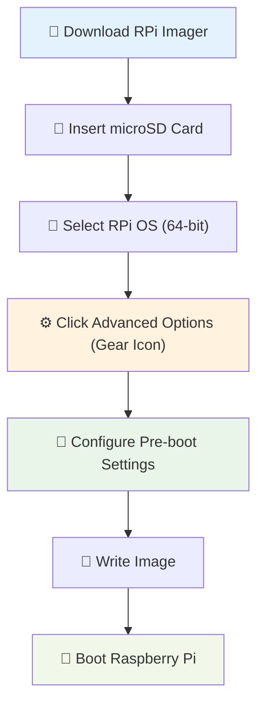

# 🥧 Complete Raspberry Pi Setup Guide

## 🎯 **Hardware Overview**

### **Recommended Hardware**

| Component | Minimum | Recommended | Notes |
|-----------|---------|-------------|-------|
| **🥧 Pi Model** | Pi 4 (2GB) | Pi 4 (4GB+) | More RAM = better performance |
| **💾 Storage** | 32GB Class 10 | 64GB+ SanDisk Extreme | Fast, reliable microSD |
| **🔌 Power** | Official 3A | Official 3A USB-C | Prevents undervoltage |
| **🌡️ Cooling** | Passive heatsinks | Active cooling fan | Better sustained performance |
| **🔗 Network** | WiFi | Gigabit Ethernet | Wired connection preferred |
| **📦 Case** | Basic case | Ventilated case | Protects hardware |

### **Hardware Shopping List**

**🛒 Essential Components**:
```
✅ Raspberry Pi 4 (4GB)           ~$75
✅ SanDisk Extreme 64GB microSD   ~$15
✅ Official USB-C Power Supply    ~$10
✅ Basic heatsink kit             ~$5
✅ HDMI cable (for setup)         ~$5
✅ Ethernet cable                 ~$5
Total: ~$115
```

**🔧 Optional Upgrades**:
```
🎯 Argon ONE V2 Case (with fan)   ~$25
🎯 USB 3.0 SSD (for better I/O)  ~$30
🎯 PoE+ HAT (for clean power)     ~$20
```

## 🖥️ **Operating System Installation**

### **Method 1: Raspberry Pi Imager (Recommended)**

**🔽 Download Raspberry Pi Imager**:
- **Windows**: [Download from official site](https://www.raspberrypi.org/software/)
- **macOS**: `brew install --cask raspberry-pi-imager`
- **Linux**: `sudo apt install rpi-imager`

**📝 Pre-configuration Setup**:



**⚙️ Advanced Options Configuration**:

1. **📡 Enable SSH**:
   - ✅ Use password authentication
   - 🔑 Set username: `pi`
   - 🔒 Set password: `[secure-password]`

2. **🌐 Configure WiFi** (if not using Ethernet):
   - 📶 SSID: `[your-wifi-name]`
   - 🔐 Password: `[your-wifi-password]`
   - 🌍 Country: `[your-country-code]`

3. **🌍 Locale Settings**:
   - 🕐 Timezone: `[your-timezone]`
   - ⌨️ Keyboard: `[your-layout]`

4. **🔧 Additional Options**:
   - ✅ Enable SSH
   - ✅ Disable overscan
   - ⚡ Skip first-run wizard

### **Method 2: Manual Image Writing**

```bash
# Download Raspberry Pi OS
wget https://downloads.raspberrypi.org/raspios_lite_arm64/images/raspios_lite_arm64-2024-03-15/2024-03-15-raspios-bookworm-arm64-lite.img.xz

# Write to SD card (replace /dev/sdX with your SD card)
unxz -c 2024-03-15-raspios-bookworm-arm64-lite.img.xz | sudo dd of=/dev/sdX bs=4M status=progress

# Enable SSH
sudo mount /dev/sdX1 /mnt
sudo touch /mnt/ssh
sudo umount /mnt
```

## 🔗 **Initial Connection & Setup**

### **Finding Your Pi on the Network**

```bash
# Method 1: Router admin panel
# Check connected devices in router interface

# Method 2: Network scan
nmap -sn 192.168.1.0/24 | grep -B2 "Raspberry Pi"

# Method 3: Hostname lookup (if mDNS works)
ping raspberrypi.local

# Method 4: Check DHCP leases
cat /var/lib/dhcp/dhcpd.leases | grep raspberry
```

### **First SSH Connection**

```bash
# Connect to your Pi
ssh pi@[pi-ip-address]
# or
ssh pi@raspberrypi.local

# Accept host key fingerprint
# Enter password you set during imaging
```

### **Initial System Update**

```bash
# Update package lists
sudo apt update

# Upgrade all packages (takes 10-15 minutes)
sudo apt upgrade -y

# Install essential tools
sudo apt install -y git curl wget htop nano vim

# Reboot to apply updates
sudo reboot
```

## ⚙️ **System Configuration**

### **Raspberry Pi Configuration Tool**

```bash
# Launch configuration tool
sudo raspi-config
```

**🔧 Recommended Settings**:

1. **🔧 System Options**:
   - **Hostname**: `privacy-hub` (easier to remember)
   - **Boot/Auto Login**: Console (no auto-login for security)

2. **🔗 Interface Options**:
   - ✅ **SSH**: Enable (if not already enabled)
   - ✅ **VNC**: Enable (for remote desktop, optional)
   - ❌ **I2C/SPI**: Disable (not needed)

3. **🚀 Advanced Options**:
   - **Memory Split**: 16MB (headless server needs minimal GPU memory)
   - **Expand Filesystem**: Yes (use full SD card space)

4. **🌍 Localization**:
   - **Timezone**: Set your timezone
   - **Keyboard**: Set your keyboard layout
   - **WiFi Country**: Set your country code

### **Static IP Configuration**

**🔗 Method 1: DHCP Reservation (Recommended)**

Configure your router to always assign the same IP to your Pi:

```bash
# Find Pi MAC address
ip link show | grep -A 1 "eth0\|wlan0"
# Look for: link/ether xx:xx:xx:xx:xx:xx

# Configure router DHCP reservation:
# MAC Address: [pi-mac-address]
# Reserved IP: 192.168.1.100 (example)
```

**🔧 Method 2: Static IP on Pi**

```bash
# Edit network configuration
sudo nano /etc/dhcpcd.conf

# Add to end of file:
interface eth0
static ip_address=192.168.1.100/24
static routers=192.168.1.1
static domain_name_servers=1.1.1.1 8.8.8.8

# For WiFi, use wlan0 instead of eth0
# interface wlan0
# static ip_address=192.168.1.100/24
# ...

# Apply changes
sudo systemctl restart dhcpcd
```

## 🐳 **Docker Installation**

### **Automated Docker Setup**

```bash
# Download Docker installation script
curl -fsSL https://get.docker.com -o get-docker.sh

# Review script (optional but recommended)
cat get-docker.sh

# Run installation script
sh get-docker.sh

# Add user to docker group (avoid sudo)
sudo usermod -aG docker $USER

# Install Docker Compose plugin
sudo apt install -y docker-compose-plugin

# Logout and login to apply group changes
exit
# SSH back in
ssh pi@[pi-ip]

# Verify installation
docker --version
docker compose version
```

### **Manual Docker Installation**

```bash
# Remove old versions
sudo apt remove docker docker-engine docker.io containerd runc

# Install dependencies
sudo apt update
sudo apt install -y \
    ca-certificates \
    curl \
    gnupg \
    lsb-release

# Add Docker's GPG key
sudo mkdir -p /etc/apt/keyrings
curl -fsSL https://download.docker.com/linux/debian/gpg | sudo gpg --dearmor -o /etc/apt/keyrings/docker.gpg

# Add Docker repository
echo \
  "deb [arch=$(dpkg --print-architecture) signed-by=/etc/apt/keyrings/docker.gpg] https://download.docker.com/linux/debian \
  $(lsb_release -cs) stable" | sudo tee /etc/apt/sources.list.d/docker.list > /dev/null

# Install Docker Engine
sudo apt update
sudo apt install -y docker-ce docker-ce-cli containerd.io docker-compose-plugin

# Test installation
sudo docker run hello-world
```

## 🔒 **Security Hardening**

### **SSH Security**

```bash
# Edit SSH configuration
sudo nano /etc/ssh/sshd_config

# Recommended changes:
Port 2222                          # Change from default 22
PermitRootLogin no                 # Disable root login
PasswordAuthentication yes         # Allow password (or use keys)
PubkeyAuthentication yes           # Enable key-based auth
MaxAuthTries 3                     # Limit login attempts
ClientAliveInterval 300            # Keep connections alive
ClientAliveCountMax 2              # Max missed keepalives

# Restart SSH service
sudo systemctl restart ssh
```

### **Firewall Configuration**

```bash
# Install UFW firewall
sudo apt install -y ufw

# Default policies
sudo ufw default deny incoming
sudo ufw default allow outgoing

# Allow SSH (on custom port if changed)
sudo ufw allow 2222/tcp           # or 22 if using default

# Allow Privacy Hub services
sudo ufw allow 53/udp             # DNS
sudo ufw allow 80/tcp             # HTTP
sudo ufw allow 443/tcp            # HTTPS

# Enable firewall
sudo ufw enable

# Check status
sudo ufw status verbose
```

### **Automatic Security Updates**

```bash
# Install unattended upgrades
sudo apt install -y unattended-upgrades

# Configure automatic updates
sudo dpkg-reconfigure -plow unattended-upgrades
# Select "Yes" when prompted

# Edit configuration (optional)
sudo nano /etc/apt/apt.conf.d/50unattended-upgrades
```

## 🔧 **Performance Optimization**

### **Memory Management**

```bash
# Configure swap (optional, for low-memory systems)
sudo dphys-swapfile swapoff
sudo nano /etc/dphys-swapfile

# Set CONF_SWAPSIZE=1024 (for 1GB swap)
sudo dphys-swapfile setup
sudo dphys-swapfile swapon
```

### **Storage Optimization**

```bash
# Move Docker root to USB SSD (if using one)
# Stop Docker
sudo systemctl stop docker

# Edit Docker daemon config
sudo nano /etc/docker/daemon.json

# Add:
{
  "data-root": "/mnt/usb-ssd/docker",
  "storage-driver": "overlay2"
}

# Create directory and move data
sudo mkdir -p /mnt/usb-ssd/docker
sudo rsync -a /var/lib/docker/ /mnt/usb-ssd/docker/

# Restart Docker
sudo systemctl start docker
```

### **CPU Governor Settings**

```bash
# Check current governor
cat /sys/devices/system/cpu/cpu0/cpufreq/scaling_governor

# Available governors
cat /sys/devices/system/cpu/cpu0/cpufreq/scaling_available_governors

# Set performance governor for better responsiveness
echo 'GOVERNOR="performance"' | sudo tee /etc/default/cpufrequtils

# Apply immediately
sudo cpufreq-set -g performance
```

## 🌡️ **Temperature Monitoring**

### **Check System Temperature**

```bash
# Check current temperature
vcgencmd measure_temp

# Monitor continuously
watch -n 2 vcgencmd measure_temp

# Advanced monitoring
sudo apt install -y lm-sensors
sensors
```

### **Temperature Alerts**

```bash
# Create temperature monitoring script
sudo nano /usr/local/bin/temp-monitor.sh

#!/bin/bash
TEMP=$(vcgencmd measure_temp | cut -d= -f2 | cut -d\' -f1)
if (( $(echo "$TEMP > 75.0" | bc -l) )); then
    echo "High temperature: ${TEMP}°C" | logger -t temp-monitor
fi

# Make executable
sudo chmod +x /usr/local/bin/temp-monitor.sh

# Add to crontab (check every 5 minutes)
echo "*/5 * * * * /usr/local/bin/temp-monitor.sh" | crontab -
```

## 📊 **System Monitoring**

### **Essential Monitoring Tools**

```bash
# Install monitoring tools
sudo apt install -y htop iotop nethogs

# Real-time system monitoring
htop                # Process and resource usage
iotop               # Disk I/O monitoring  
nethogs             # Network usage by process
```

### **System Information Commands**

```bash
# Hardware information
cat /proc/cpuinfo           # CPU details
cat /proc/meminfo           # Memory information
lsblk                       # Storage devices
lsusb                       # USB devices
iwconfig                    # WiFi information

# System status
uptime                      # System uptime and load
df -h                       # Disk usage
free -h                     # Memory usage
ip addr show                # Network interfaces
```

## 🎯 **Ready for Privacy Hub**

### **Final Preparation Checklist**

```bash
# ✅ System fully updated
sudo apt update && sudo apt upgrade -y

# ✅ Docker working
docker --version && docker compose version

# ✅ Static IP configured
ip addr show | grep inet

# ✅ SSH accessible
# Test from another device: ssh pi@[pi-ip]

# ✅ Internet connectivity
ping -c 3 google.com

# ✅ Adequate disk space
df -h | grep "/$"           # Should have 10GB+ free
```

### **Download Privacy Hub**

```bash
# Clone the repository
git clone https://github.com/your-repo/privacy-hub.git
cd privacy-hub

# Verify files
ls -la configure setup manage scripts/

# You're ready! Run:
./configure
```

## 🚨 **Troubleshooting**

### **Common Setup Issues**

| Problem | Symptoms | Solution |
|---------|----------|----------|
| **🔴 Can't SSH to Pi** | Connection refused | Check IP, SSH enabled, firewall |
| **🔴 WiFi not working** | No internet connection | Check credentials, country code |
| **🟡 Slow performance** | High load average | Check temperature, add cooling |
| **🔴 Docker permission denied** | Can't run containers | Add user to docker group |
| **🟡 Low disk space** | Install failures | Expand filesystem, clean packages |

### **Diagnostic Commands**

```bash
# System health check
sudo systemctl status ssh
sudo systemctl status docker
vcgencmd measure_temp
df -h
free -h

# Network connectivity
ping google.com
ip route show
cat /etc/resolv.conf

# Hardware status
dmesg | tail -20
journalctl -xe
```

### **Recovery Options**

```bash
# Factory reset (preserves user data)
sudo apt autoremove --purge
sudo apt autoclean

# Emergency boot (if Pi won't boot)
# Add to /boot/config.txt on another computer:
# gpu_mem=16
# disable_overscan=1

# Re-image SD card if all else fails
```

---

**🎉 Your Raspberry Pi is now ready for Privacy Hub deployment!** 

**Next steps**: Return to the main installation guide and run `./configure` to set up your privacy gateway.