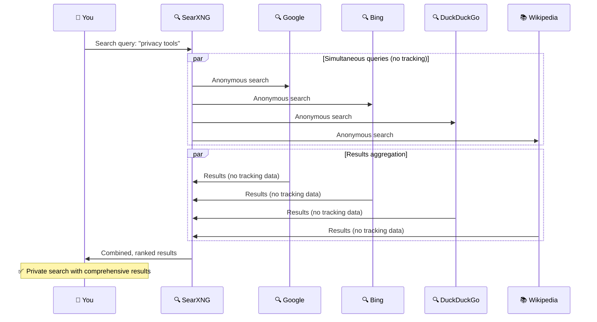

# 🔍 SearXNG Configuration & Customization Guide

## 🎯 **What is SearXNG?**

SearXNG is a **privacy-respecting metasearch engine** that aggregates results from multiple search engines without tracking users or storing personal data. It provides Google-quality search results while protecting your privacy.

## 🌐 **How SearXNG Works**



## 🔧 **Accessing SearXNG**

### **Web Interface**
- **Search URL**: `https://your-pi-ip/`
- **Preferences**: `https://your-pi-ip/preferences`
- **Statistics**: `https://your-pi-ip/stats`

### **Command Line Management**
```bash
# Quick SearXNG management
./manage

# Navigate to: Service Management → SearXNG Management
# Or use direct commands:
./manage logs searxng    # View logs
```

## 🎨 **Theme Customization**

### **Available Themes**

| Theme | Description | Best For |
|-------|-------------|----------|
| **🌙 Simple** | Clean, dark theme | Privacy-focused users |
| **🎨 Oscar** | Feature-rich interface | Power users |
| **🖼️ Pix-art** | Image-focused design | Visual searches |

### **Changing Themes**

**Via Web Interface**:
1. **Access**: `https://your-pi-ip/preferences`
2. **User Interface Tab**: Click UI settings
3. **Theme**: Select from dropdown
4. **Save**: Click save button

**Via Management Script**:
```bash
# Interactive theme selection
./manage
# → Service Management → SearXNG Management → Update Configuration
```

**Via Environment Configuration**:
```bash
# Edit environment file
nano .env

# Change SEARXNG_DEFAULT_THEME value:
SEARXNG_DEFAULT_THEME=oscar     # or simple, pix-art

# Restart SearXNG
./manage restart searxng
```

## ⚙️ **Search Engine Configuration**

### **Default Search Engines**

SearXNG queries multiple engines simultaneously:

| Engine | Purpose | Default |
|--------|---------|---------|
| **🔍 Google** | Web search | ✅ Enabled |
| **🔍 Bing** | Web search | ✅ Enabled |
| **🔍 DuckDuckGo** | Privacy search | ✅ Enabled |
| **📚 Wikipedia** | Encyclopedia | ✅ Enabled |
| **🎥 YouTube** | Video search | ✅ Enabled |
| **🐙 GitHub** | Code search | ✅ Enabled |
| **🗞️ Reddit** | Discussion search | ✅ Enabled |

### **Enabling/Disabling Engines**

**Via Web Interface**:
1. **Preferences**: `https://your-pi-ip/preferences`
2. **Engines Tab**: Click engines
3. **Toggle Engines**: Check/uncheck desired engines
4. **Save Settings**: Click save

### **Custom Engine Categories**

| Category | Engines | Use Case |
|----------|---------|----------|
| **🌐 General** | Google, Bing, DDG | Web search |
| **🖼️ Images** | Google Images, Bing Images | Photo search |
| **🎥 Videos** | YouTube, Vimeo | Video content |
| **📰 News** | Google News, Bing News | Current events |
| **🛒 Shopping** | Amazon, eBay | Product search |
| **🗺️ Maps** | OpenStreetMap, Google Maps | Location search |
| **🎵 Music** | Spotify, SoundCloud | Audio content |
| **📚 Academic** | Google Scholar, arXiv | Research |

## 🔒 **Privacy & Safety Settings**

### **Safe Search Configuration**

| Level | Description | Recommended For |
|-------|-------------|-----------------|
| **0 - Off** | No content filtering | Adults only |
| **1 - Moderate** | Basic filtering | Most users ✅ |
| **2 - Strict** | Maximum filtering | Families with children |

**Configure Safe Search**:
```bash
# Via management interface
./manage
# → Service Management → SearXNG Management → Update Configuration

# Or edit environment directly:
nano .env
SEARXNG_SAFE_SEARCH=1    # 0=off, 1=moderate, 2=strict
```

### **Privacy Features**

**Automatic Privacy Protection**:
- ✅ **No user tracking** - No cookies or session storage
- ✅ **No search logging** - Queries are not stored
- ✅ **Proxy requests** - Your IP is hidden from search engines
- ✅ **No ads** - Clean, ad-free results
- ✅ **HTTPS encryption** - All traffic is encrypted

**Additional Privacy Settings**:
1. **Preferences**: `https://your-pi-ip/preferences`
2. **General Tab**: Configure privacy options
3. **Options**:
   - **Autocomplete**: Disable to prevent query suggestions
   - **Image proxy**: Enable to hide IP from image sources
   - **Method**: GET vs POST for search queries

## 🌍 **Language & Localization**

### **Setting Default Language**

**Available Languages**:
- 🇺🇸 **English (en)** - Default
- 🇪🇪 **Estonian (et)**
- 🇩🇪 **German (de)**
- 🇫🇷 **French (fr)**
- 🇪🇸 **Spanish (es)**
- 🇮🇹 **Italian (it)**
- 🇷🇺 **Russian (ru)**
- 🇨🇳 **Chinese (zh)**
- 🇯🇵 **Japanese (ja)**

**Change Language**:
```bash
# Via management interface
./manage
# → Service Management → SearXNG Management → Update Configuration

# Or edit environment:
nano .env
SEARXNG_DEFAULT_LANG=de    # German example
```

### **Regional Search Results**

Configure region-specific results:
1. **Preferences**: `https://your-pi-ip/preferences`
2. **General Tab**: Select language and region
3. **Search Language**: Choose preferred language
4. **Interface Language**: Choose UI language

## 🔧 **Advanced Configuration**

### **Custom Instance Settings**

**Access Configuration File**:
```bash
# View current settings
./manage logs searxng

# Edit SearXNG settings (advanced users)
nano searxng/settings.yml
```

**Key Configuration Options**:

```yaml
# Example advanced settings
server:
  secret_key: "auto-generated-secret"
  image_proxy: true

search:
  safe_search: 1
  autocomplete: ""
  default_lang: "en"

ui:
  default_theme: simple
  default_locale: ""
  theme_args:
    simple_style: dark
```

### **Custom Search Categories**

**Add Custom Categories**:
1. Edit `searxng/settings.yml`
2. Add custom categories:

```yaml
categories_as_tabs:
  general:
    - web
  images:
    - images
  videos: 
    - videos
  music:
    - music
  files:
    - files
  science:
    - science
```

### **Engine Weights & Priorities**

**Customize Result Ranking**:
```yaml
engines:
  - name: google
    weight: 1.0
    shortcut: g
  
  - name: duckduckgo
    weight: 0.8
    shortcut: ddg
  
  - name: bing
    weight: 0.6
    shortcut: b
```

## 📊 **Usage Statistics & Monitoring**

### **Instance Statistics**
**Access**: `https://your-pi-ip/stats`

**Available Metrics**:
- 📈 **Search queries**: Total and recent searches
- 🔍 **Engine usage**: Which engines are queried most
- 🌍 **Language distribution**: User language preferences
- 📱 **User agents**: Browser and device statistics

### **Performance Monitoring**

```bash
# Check SearXNG performance
./manage
# → Status & Monitoring → Show SearXNG Statistics

# View resource usage
./manage
# → Status & Monitoring → Resource Usage

# Monitor logs
./manage logs searxng
```

## 🎯 **Search Tips & Tricks**

### **Advanced Search Operators**

| Operator | Function | Example |
|----------|----------|---------|
| **!g** | Search only Google | `!g privacy tools` |
| **!ddg** | Search only DuckDuckGo | `!ddg secure browsers` |
| **!w** | Search Wikipedia | `!w raspberry pi` |
| **!gh** | Search GitHub | `!gh privacy-hub` |
| **!yt** | Search YouTube | `!yt linux tutorials` |
| **!r** | Search Reddit | `!r raspberry pi projects` |

### **Category-Specific Searches**

**Direct Category Access**:
- **Images**: `https://your-pi-ip/?category_images=1`
- **Videos**: `https://your-pi-ip/?category_videos=1`
- **News**: `https://your-pi-ip/?category_news=1`
- **Maps**: `https://your-pi-ip/?category_map=1`

### **Query Modifiers**

```bash
# Exact phrase search
"privacy hub raspberry pi"

# Exclude terms
privacy tools -facebook

# File type search
privacy guide filetype:pdf

# Site-specific search
site:github.com privacy tools
```

## 🔧 **Custom Themes & Styling**

### **Theme Development**

**Theme Structure**:
```
searxng/
└── themes/
    ├── simple/        # Dark, minimal theme
    ├── oscar/         # Feature-rich theme  
    └── pix-art/       # Image-focused theme
```

**Custom CSS**:
1. Create custom theme directory
2. Copy base theme files
3. Modify CSS styles
4. Configure in `settings.yml`

### **Color Scheme Customization**

**Simple Theme Variables**:
```css
/* Dark theme colors */
:root {
  --color-base-background: #1a1a1a;
  --color-base-font: #ffffff;
  --color-accent: #2196f3;
  --color-success: #4caf50;
  --color-error: #f44336;
}
```

## 🔌 **Plugins & Extensions**

### **Built-in Features**

| Feature | Purpose | Enable |
|---------|---------|--------|
| **🖼️ Image Proxy** | Hide IP from image sources | Preferences → General |
| **🔒 HTTPS Rewrite** | Force HTTPS for results | Preferences → General |
| **🌍 Hostname Replace** | Replace tracking hostnames | Auto-enabled |
| **🎨 Result Clustering** | Group similar results | Preferences → Results |

### **Custom Plugins**

**Available Plugins**:
- **Tracker Removal**: Strip tracking parameters
- **Hash Plugin**: Calculate file hashes
- **Unit Converter**: Convert units in results
- **Calculator**: Perform calculations

**Enable Plugins**:
```yaml
# In searxng/settings.yml
enabled_plugins:
  - 'Hash plugin'
  - 'Tracker URL remover'
  - 'Unit converter plugin'
  - 'Basic Calculator'
```

## 📚 **External Resources**

### **Official Documentation**
- [SearXNG Documentation](https://docs.searxng.org/)
- [SearXNG GitHub](https://github.com/searxng/searxng)
- [Configuration Guide](https://docs.searxng.org/admin/settings.html)

### **Public Instances**
- [SearXNG Instances List](https://searx.space/)
- [Instance Statistics](https://stats.searxng.org/)

### **Community Resources**
- [r/searx](https://reddit.com/r/searx) - Reddit community
- [Matrix Chat](https://matrix.to/#/#searxng:matrix.org) - Real-time chat

## 🚨 **Troubleshooting**

### **Common Issues**

| Problem | Symptoms | Solution |
|---------|----------|----------|
| **🔴 No search results** | Empty result pages | Check engine configuration |
| **🟡 Slow searches** | Long response times | Disable slow engines |
| **🔴 Engine timeouts** | Missing results from engines | Increase timeout values |
| **🟡 Theme not loading** | Default theme displayed | Check theme file permissions |
| **🔴 Preferences not saving** | Settings reset on refresh | Check cookie settings |

### **Diagnostic Commands**

```bash
# Check SearXNG status
./manage
# → Service Management → SearXNG Management → Show Status

# Test search functionality
./manage
# → Service Management → SearXNG Management → Test Search Function

# View detailed logs
./manage logs searxng

# Restart SearXNG
./manage restart searxng
```

### **Performance Optimization**

```bash
# Optimize SearXNG performance
# 1. Disable unused engines
# 2. Adjust timeout values
# 3. Reduce concurrent requests

# Monitor resource usage
./manage
# → Status & Monitoring → Resource Usage
```

---

**💡 Pro Tip**: Use the preferences page (`https://your-pi-ip/preferences`) to customize your search experience, then bookmark it for quick access to your personalized search engine!