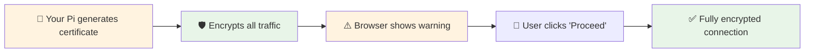
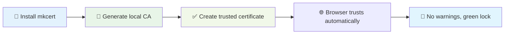

# 🔒 SSL Certificate Management Guide

## 🎯 **SSL in Privacy Hub**

Privacy Hub uses **HTTPS everywhere** to ensure all communication between your devices and the privacy services is encrypted. This guide covers everything from basic self-signed certificates to production-ready trusted certificates.

## 🔐 **Certificate Types Explained**

### **Self-Signed Certificates**



**Pros**:
- ✅ **Free and automatic** - Generated during setup
- ✅ **Full encryption** - Same security as paid certificates
- ✅ **No external dependencies** - Works offline
- ✅ **Perfect for local networks** - Ideal for home use

**Cons**:
- ⚠️ **Browser warnings** - "Not secure" warning initially
- ⚠️ **Manual acceptance** - Must click "Proceed" first time

### **Trusted Certificates (mkcert)**



**Pros**:
- ✅ **No browser warnings** - Green lock icon immediately
- ✅ **Automatic trust** - Works on all devices where CA is installed
- ✅ **Development-friendly** - Perfect for local development
- ✅ **Easy management** - Simple installation and renewal

**Cons**:
- 🔧 **Requires setup** - Need to install mkcert and CA
- 🏠 **Local network only** - Not for public internet

## 🚀 **Quick SSL Management**

### **Interactive SSL Management**

```bash
# Access SSL management menu
./manage

# Navigate to: Security & Authentication → SSL options
# Or use quick commands:
./manage ssl                # Upgrade to trusted certificates
```

### **Check Current Certificate Status**

```bash
# Check certificate details
./manage
# → Security & Authentication → Check Certificate Status

# Or manual check:
openssl x509 -in nginx/ssl/nginx.crt -noout -subject -issuer -dates
```

## 🔧 **Self-Signed Certificate Management**

### **Automatic Generation**

Self-signed certificates are **automatically generated** during Privacy Hub setup:

```bash
# Generated automatically during ./setup
# Location: nginx/ssl/nginx.crt and nginx/ssl/nginx.key
# Valid for: 365 days
# Includes: Pi IP, hostname.local, localhost
```

### **Manual Regeneration**

```bash
# Regenerate self-signed certificate
./manage
# → Security & Authentication → Update SSL Certificates

# This will:
# 1. Backup existing certificate
# 2. Generate new certificate with current Pi IP
# 3. Restart NGINX to use new certificate
```

### **Custom Self-Signed Certificate**

```bash
# Generate custom certificate with specific domains
cd nginx/ssl

# Create certificate configuration
cat > cert.conf << EOF
[req]
default_bits = 2048
prompt = no
default_md = sha256
distinguished_name = dn
req_extensions = v3_req

[dn]
C=US
ST=Local
L=Local
O=Privacy Hub
CN=privacy-hub.local

[v3_req]
subjectAltName = @alt_names

[alt_names]
DNS.1 = privacy-hub.local
DNS.2 = pihole.local
DNS.3 = search.local
DNS.4 = localhost
IP.1 = 192.168.1.100
IP.2 = 127.0.0.1
EOF

# Generate certificate
openssl req -x509 -newkey rsa:2048 \
    -keyout nginx.key -out nginx.crt \
    -days 365 -nodes -config cert.conf

# Set permissions
chmod 600 nginx.key
chmod 644 nginx.crt

# Restart NGINX
docker compose restart nginx
```

## ✅ **Trusted Certificate Setup (mkcert)**

### **Installing mkcert**

**🐧 Linux (Ubuntu/Debian)**:
```bash
# Install prerequisites
sudo apt install libnss3-tools

# Download and install mkcert
curl -JLO "https://dl.filippo.io/mkcert/latest?for=linux/amd64"
chmod +x mkcert-v*-linux-amd64
sudo mv mkcert-v*-linux-amd64 /usr/local/bin/mkcert

# Verify installation
mkcert -version
```

**🍎 macOS**:
```bash
# Using Homebrew
brew install mkcert

# Using direct download
curl -JLO "https://dl.filippo.io/mkcert/latest?for=darwin/amd64"
chmod +x mkcert-v*-darwin-amd64
sudo mv mkcert-v*-darwin-amd64 /usr/local/bin/mkcert
```

**🪟 Windows**:
```powershell
# Using Chocolatey
choco install mkcert

# Using Scoop
scoop bucket add extras
scoop install mkcert

# Manual download from: https://github.com/FiloSottile/mkcert/releases
```

### **Setting Up Local Certificate Authority**

```bash
# Install local CA (run this once)
mkcert -install

# This creates a local Certificate Authority that:
# ✅ Is trusted by your system
# ✅ Works in all browsers
# ✅ Can be shared with other devices
```

### **Generating Trusted Certificates for Privacy Hub**

```bash
# Upgrade to trusted certificates
./manage ssl

# Or manual generation:
cd nginx/ssl

# Generate certificate for your specific domains
mkcert privacy-hub.local localhost 127.0.0.1 192.168.1.100

# Rename files to expected names
mv privacy-hub.local+3.pem nginx.crt
mv privacy-hub.local+3-key.pem nginx.key

# Set permissions
chmod 600 nginx.key
chmod 644 nginx.crt

# Restart NGINX
docker compose restart nginx
```

## 🌐 **Multi-Device Certificate Trust**

### **Installing CA on Other Devices**

**📱 iOS/iPadOS**:
1. **Export CA**: `mkcert -CAROOT` (find `rootCA.pem`)
2. **Email to device** or use AirDrop
3. **Install profile**: Settings → Downloaded Profile → Install
4. **Trust certificate**: Settings → General → About → Certificate Trust Settings

**🤖 Android**:
1. **Export CA**: Copy `rootCA.pem` to device
2. **Install CA**: Settings → Security → Install from storage
3. **Select certificate** and name it "Privacy Hub CA"

**🪟 Windows**:
```powershell
# Run on target Windows machine
mkcert -install

# Or manually import the CA:
# certmgr.msc → Trusted Root Certification Authorities → Import
```

**🍎 macOS**:
```bash
# Install mkcert on target Mac
brew install mkcert
mkcert -install

# Or manually via Keychain Access:
# Open Keychain Access → System → Add rootCA.pem → Trust: Always Trust
```

### **Network-Wide Trust Setup**

```bash
# Copy CA to Privacy Hub for easy distribution
mkdir -p nginx/ssl/ca
mkcert -CAROOT | xargs -I {} cp {}/rootCA.pem nginx/ssl/ca/

# Now accessible at: https://your-pi-ip/ca/rootCA.pem
# Add this location to your NGINX config for easy downloads
```

## 🔄 **Certificate Renewal**

### **Automatic Renewal Strategy**

```bash
# Create renewal script
sudo nano /usr/local/bin/privacy-hub-ssl-renew.sh

#!/bin/bash
cd /home/pi/privacy-hub
./manage ssl
docker compose restart nginx

# Make executable
sudo chmod +x /usr/local/bin/privacy-hub-ssl-renew.sh

# Add to crontab (renew monthly)
echo "0 3 1 * * /usr/local/bin/privacy-hub-ssl-renew.sh" | crontab -
```

### **Certificate Expiration Monitoring**

```bash
# Check certificate expiration
openssl x509 -in nginx/ssl/nginx.crt -noout -dates

# Create expiration alert script
sudo nano /usr/local/bin/cert-expiry-check.sh

#!/bin/bash
CERT_FILE="/home/pi/privacy-hub/nginx/ssl/nginx.crt"
EXPIRY_DATE=$(openssl x509 -in $CERT_FILE -noout -enddate | cut -d= -f2)
EXPIRY_EPOCH=$(date -d "$EXPIRY_DATE" +%s)
CURRENT_EPOCH=$(date +%s)
DAYS_UNTIL_EXPIRY=$(( ($EXPIRY_EPOCH - $CURRENT_EPOCH) / 86400 ))

if [ $DAYS_UNTIL_EXPIRY -lt 30 ]; then
    echo "SSL certificate expires in $DAYS_UNTIL_EXPIRY days!" | logger -t ssl-monitor
fi

# Run weekly
echo "0 9 * * 1 /usr/local/bin/cert-expiry-check.sh" | crontab -
```

## 🔧 **Advanced SSL Configuration**

### **Custom SSL Settings in NGINX**

```bash
# Edit NGINX SSL configuration
nano nginx/nginx.conf

# Advanced SSL settings:
ssl_protocols TLSv1.2 TLSv1.3;
ssl_ciphers ECDHE-RSA-AES128-GCM-SHA256:ECDHE-RSA-AES256-GCM-SHA384;
ssl_prefer_server_ciphers off;
ssl_session_cache shared:SSL:10m;
ssl_session_timeout 10m;

# HSTS (HTTP Strict Transport Security)
add_header Strict-Transport-Security "max-age=31536000; includeSubDomains" always;

# Additional security headers
add_header X-Content-Type-Options nosniff;
add_header X-Frame-Options DENY;
add_header X-XSS-Protection "1; mode=block";
```

### **SSL Performance Optimization**

```bash
# Enable SSL session caching
ssl_session_cache shared:SSL:50m;
ssl_session_timeout 1d;
ssl_session_tickets off;

# Use modern ciphers only
ssl_ciphers ECDHE-RSA-AES256-GCM-SHA512:DHE-RSA-AES256-GCM-SHA512:ECDHE-RSA-AES256-GCM-SHA384;

# Enable OCSP stapling
ssl_stapling on;
ssl_stapling_verify on;
```

## 🔍 **SSL Troubleshooting**

### **Common SSL Issues**

| Problem | Symptoms | Solution |
|---------|----------|----------|
| **🔴 Certificate expired** | Browser security error | Renew certificate with `./manage ssl` |
| **🔴 Wrong hostname** | Name mismatch error | Regenerate with correct hostname/IP |
| **🔴 Permission denied** | NGINX fails to start | Check file permissions (key=600, cert=644) |
| **🟡 Browser warnings** | "Not secure" message | Install CA or click "Proceed" |
| **🔴 SSL handshake fails** | Connection timeout | Check firewall, port 443 open |

### **SSL Diagnostic Commands**

```bash
# Test SSL connection
openssl s_client -connect your-pi-ip:443 -servername privacy-hub.local

# Check certificate details
openssl x509 -in nginx/ssl/nginx.crt -text -noout

# Verify certificate chain
openssl verify -CAfile nginx/ssl/ca-bundle.crt nginx/ssl/nginx.crt

# Test from browser
curl -k -v https://your-pi-ip/health

# Check NGINX SSL config
./manage
# → Service Management → NGINX Management → Test Configuration
```

### **SSL Performance Testing**

```bash
# Test SSL performance
openssl speed rsa2048

# Benchmark HTTPS throughput
ab -n 1000 -c 10 -k https://your-pi-ip/health

# Check SSL cipher being used
curl -vv https://your-pi-ip 2>&1 | grep -i cipher
```

## 📊 **SSL Security Assessment**

### **Online SSL Testing**

**🔍 SSL Labs Test** (for public sites):
- Visit: https://www.ssllabs.com/ssltest/
- Not applicable for local networks

**🛡️ Local Security Check**:
```bash
# Check SSL configuration strength
nmap --script ssl-enum-ciphers -p 443 your-pi-ip

# Verify certificate transparency
curl -H "Accept: application/json" "https://crt.sh/?q=privacy-hub.local"
```

### **Security Best Practices**

**✅ Certificate Management**:
- 🔄 **Regular renewal** - Set up automatic renewal
- 🔒 **Strong key sizes** - Use 2048-bit RSA minimum
- 🛡️ **Modern protocols** - TLS 1.2+ only
- 📱 **Mobile compatibility** - Test on all devices

**✅ NGINX Configuration**:
- 🚫 **Disable weak ciphers** - Remove RC4, 3DES
- ⚡ **Enable HSTS** - Force HTTPS connections
- 🔒 **Security headers** - Prevent common attacks
- 📈 **Performance tuning** - Optimize for speed

## 📚 **External Resources**

### **Certificate Tools**
- [mkcert GitHub](https://github.com/FiloSottile/mkcert) - Local CA tool
- [SSL Labs Tools](https://www.ssllabs.com/projects/) - SSL testing suite
- [Mozilla SSL Config](https://ssl-config.mozilla.org/) - NGINX SSL generator

### **Documentation**
- [NGINX SSL Module](https://nginx.org/en/docs/http/ngx_http_ssl_module.html)
- [OpenSSL Documentation](https://www.openssl.org/docs/)
- [Let's Encrypt Docs](https://letsencrypt.org/docs/) - For public certificates

---

**🔒 Your Privacy Hub now has enterprise-grade SSL encryption!**

**Quick Access**: Use `./manage ssl` to upgrade certificates or `./manage` → Security & Authentication for full SSL management options.